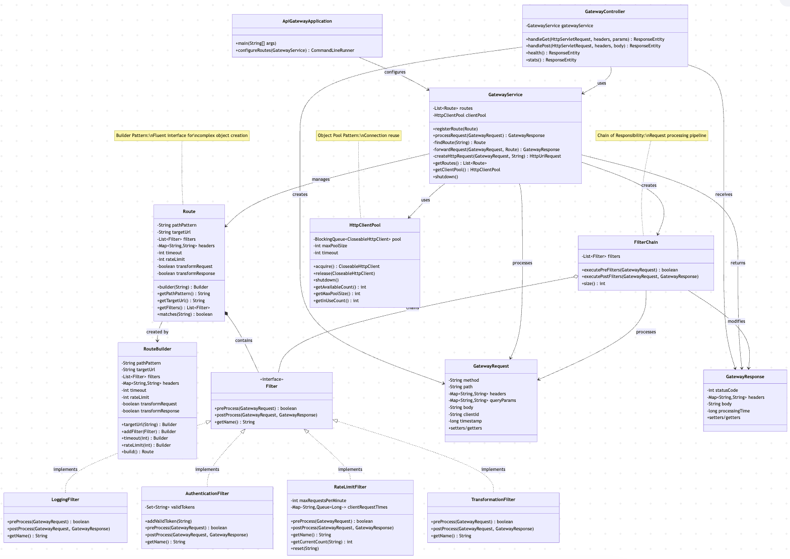
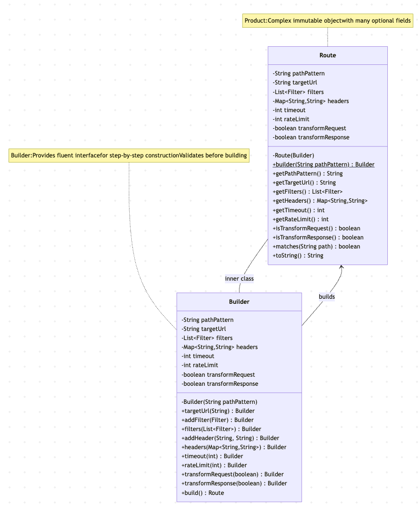
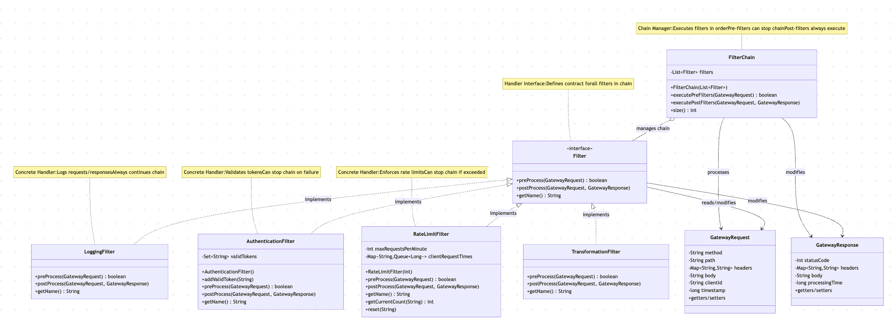
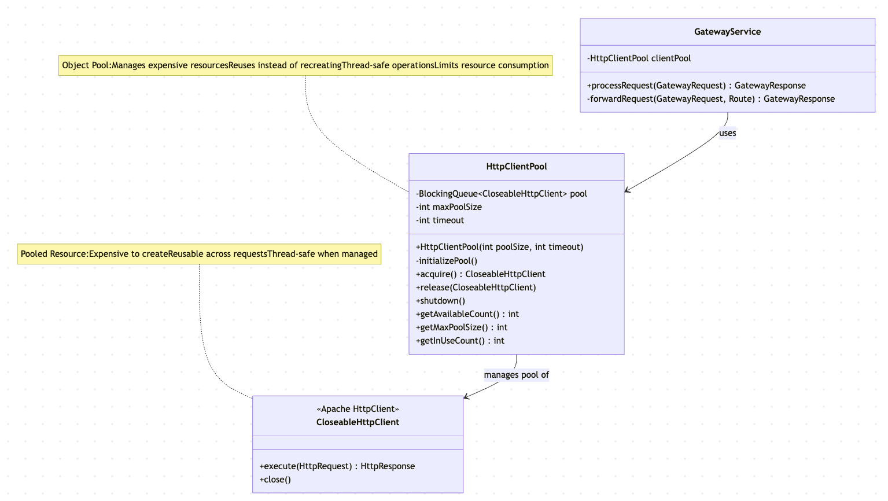

| CS-665       | Software Design & Patterns |
|--------------|----------------------------|
| Name         | Javier Esteban de Celis    |
| Date         | 12/01/2025                 |
| Course       | CS665                      |
| Assignment # | Final Project              |


# Assignment Overview

This project implements a **Spring Boot API Gateway**. The API Gateway serves as a reverse proxy that sits between clients and backend services, providing features like request/response filtering, authentication, rate limiting, logging, and connection pooling for optimal performance.


# GitHub Repository Link:
https://github.com/JaviEst/cs-665-final-project

# Implementation Description

## Design Patterns Implemented

### 1. Builder Pattern (`Route.java`)

The Builder Pattern is used to construct complex `Route` objects with many optional parameters in a fluent and readable way. This pattern eliminates telescoping constructors and provides an intuitive API for route configuration.

**Example:**
```java
Route route = Route.builder("/api/users")
    .targetUrl("http://backend:8081/users")
    .addFilter(new LoggingFilter())
    .addFilter(new AuthenticationFilter())
    .timeout(5000)
    .rateLimit(100)
    .build();
```

### 2. Chain of Responsibility Pattern (`FilterChain.java`)

The Chain of Responsibility Pattern allows requests to pass through a chain of filters, where each filter can process the request, pass it to the next handler, or stop the chain if needed.

**Filters Implemented:**
- `LoggingFilter` - Logs request/response details
- `AuthenticationFilter` - Validates authentication tokens
- `RateLimitFilter` - Implements rate limiting per client
- `TransformationFilter` - Transforms request/response data

### 3. Object Pool Pattern (`HttpClientPool.java`)

The Object Pool Pattern manages a pool of reusable HTTP client objects to avoid expensive creation/destruction operations, improving performance and limiting resource consumption.

## Flexibility

The implementation is highly flexible:
- **Easy to add new filters:** Simply implement the `Filter` interface and add to any route
- **Easy to add new routes:** Use the Builder pattern to configure routes without modifying existing code
- **Configurable pool sizes:** HTTP client pool can be sized based on load requirements
- **Extensible architecture:** Each component is independent and can be modified without affecting others

## Simplicity and Understandability

The code is designed for simplicity:
- **Clear separation of concerns:** Each pattern is in its own package
- **Well-documented code:** Every class and method has JavaDoc comments
- **Intuitive APIs:** Builder pattern provides readable, self-documenting code
- **Consistent naming:** All classes follow Java naming conventions with 2-space indentation
- **Comprehensive tests:** Each pattern has dedicated unit tests demonstrating functionality

## Avoiding Duplicated Code

The implementation avoids code duplication through:
- **Interface-based design:** `Filter` interface ensures consistent filter behavior
- **Reusable components:** Filters can be used across multiple routes
- **Pooled resources:** HTTP clients are reused across all requests
- **DRY principle:** Common functionality is extracted into base classes

This is important because:
- Reduces maintenance burden (changes in one place)
- Minimizes bugs (no need to update multiple locations)
- Improves code readability and understanding
- Follows SOLID principles


# Run the Application

## Prerequisites
- Java 8 or higher
- Maven 3.6+

## Build and Compile
To compile the code, run:
```bash
mvn clean compile
```

## Run Unit Tests
To run all unit tests:
```bash
mvn clean test
```

## Run the Spring Boot Application
To start the API Gateway server:
```bash
mvn spring-boot:run
```

The application will start on `http://localhost:8080`

## Available Endpoints

**Health Check:**
```bash
curl http://localhost:8080/health
```

**Gateway Statistics:**
```bash
curl http://localhost:8080/stats
```

**Test Routes:**

1. Public route (no authentication):
```bash
curl http://localhost:8080/api/public
```

2. Secure route (requires authentication):
```bash
curl -H "Authorization: Bearer token-123" http://localhost:8080/api/secure
```

3. Rate-limited route:
```bash
curl -H "Authorization: Bearer token-123" \
     -H "X-Client-Id: client-1" \
     http://localhost:8080/api/data
```


# UML Class Diagrams

## API Gateway Overall UML Class Diagram




## Builder Pattern UML Class Diagram




## Chain of Responsability Pattern UML Class Diagram




## Object Pool Pattern UML Class Diagram




# Maven Commands

We'll use Apache Maven to compile and run this project. You'll need to install Apache Maven (https://maven.apache.org/) on your system. 

Apache Maven is a build automation tool and a project management tool for Java-based projects. Maven provides a standardized way to build, package, and deploy Java applications.

Maven uses a Project Object Model (POM) file to manage the build process and its dependencies. The POM file contains information about the project, such as its dependencies, the build configuration, and the plugins used for building and packaging the project.

Maven provides a centralized repository for storing and accessing dependencies, which makes it easier to manage the dependencies of a project. It also provides a standardized way to build and deploy projects, which helps to ensure that builds are consistent and repeatable.

Maven also integrates with other development tools, such as IDEs and continuous integration systems, making it easier to use as part of a development workflow.

Maven provides a large number of plugins for various tasks, such as compiling code, running tests, generating reports, and creating JAR files. This makes it a versatile tool that can be used for many different types of Java projects.

## Compile
Type on the command line: 

```bash
mvn clean compile
```


## JUnit Tests
JUnit is a popular testing framework for Java. JUnit tests are automated tests that are written to verify that the behavior of a piece of code is as expected.

In JUnit, tests are written as methods within a test class. Each test method tests a specific aspect of the code and is annotated with the @Test annotation. JUnit provides a range of assertions that can be used to verify the behavior of the code being tested.

JUnit tests are executed automatically and the results of the tests are reported. This allows developers to quickly and easily check if their code is working as expected, and make any necessary changes to fix any issues that are found.

The use of JUnit tests is an important part of Test-Driven Development (TDD), where tests are written before the code they are testing is written. This helps to ensure that the code is written in a way that is easily testable and that all required functionality is covered by tests.

JUnit tests can be run as part of a continuous integration pipeline, where tests are automatically run every time changes are made to the code. This helps to catch any issues as soon as they are introduced, reducing the need for manual testing and making it easier to ensure that the code is always in a releasable state.

To run, use the following command:
```bash
mvn clean test
```


## Spotbugs 

SpotBugs is a static code analysis tool for Java that detects potential bugs in your code. It is an open-source tool that can be used as a standalone application or integrated into development tools such as Eclipse, IntelliJ, and Gradle.

SpotBugs performs an analysis of the bytecode generated from your Java source code and reports on any potential problems or issues that it finds. This includes things like null pointer exceptions, resource leaks, misused collections, and other common bugs.

The tool uses data flow analysis to examine the behavior of the code and detect issues that might not be immediately obvious from just reading the source code. SpotBugs is able to identify a wide range of issues and can be customized to meet the needs of your specific project.

Using SpotBugs can help to improve the quality and reliability of your code by catching potential bugs early in the development process. This can save time and effort in the long run by reducing the need for debugging and fixing issues later in the development cycle. SpotBugs can also help to ensure that your code is secure by identifying potential security vulnerabilities.

Use the following command:

```bash
mvn spotbugs:gui 
```

For more info see 
https://spotbugs.readthedocs.io/en/latest/maven.html

SpotBugs https://spotbugs.github.io/ is the spiritual successor of FindBugs.


## Checkstyle 

Checkstyle is a development tool for checking Java source code against a set of coding standards. It is an open-source tool that can be integrated into various integrated development environments (IDEs), such as Eclipse and IntelliJ, as well as build tools like Maven and Gradle.

Checkstyle performs static code analysis, which means it examines the source code without executing it, and reports on any issues or violations of the coding standards defined in its configuration. This includes issues like code style, code indentation, naming conventions, code structure, and many others.

By using Checkstyle, developers can ensure that their code adheres to a consistent style and follows best practices, making it easier for other developers to read and maintain. It can also help to identify potential issues before the code is actually run, reducing the risk of runtime errors or unexpected behavior.

Checkstyle is highly configurable and can be customized to fit the needs of your team or organization. It supports a wide range of coding standards and can be integrated with other tools, such as code coverage and automated testing tools, to create a comprehensive and automated software development process.

The following command will generate a report in HTML format that you can open in a web browser. 

```bash
mvn checkstyle:checkstyle
```

The HTML page will be found at the following location:
`target/site/checkstyle.html`
